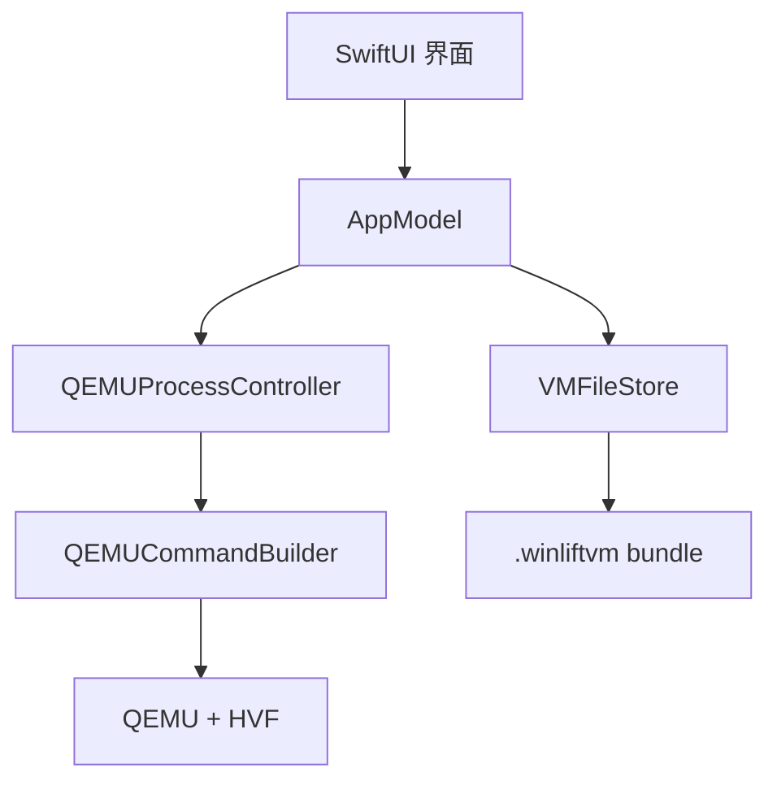

# WinLift 架构

## 目标边界

v0.1 的目标是让 Apple Silicon Mac 用户从官方 ARM64 ISO 创建并启动一台 Windows 虚拟机，同时保持工程足够小、可测试、可继续演进。虚拟机管理和 UI 由 WinLift 负责，硬件模拟由用户独立安装的 QEMU 负责，CPU 虚拟化交给 macOS HVF。

## 模块

| 模块 | 职责 |
| --- | --- |
| `WinLiftCore` | VM 值类型、校验、路径布局、QEMU 探测和纯命令生成 |
| `VMFileStore` | JSON 配置加载/保存和 artifact 存在性检查 |
| `VMProvisioner` | 原子式创建 VM bundle、稀疏磁盘和 EFI 变量文件 |
| `QEMUProcessController` | 子进程、日志和 QMP 生命周期控制 |
| `AppModel` | UI 用例编排、选择状态和错误呈现 |
| `Views` | macOS sidebar/detail/create sheet |

## 设备选择

- `-accel hvf -cpu host`：同架构硬件加速。
- `nvme` + raw sparse disk：避免 Windows 安装阶段依赖 VirtIO 磁盘驱动。
- `nec-usb-xhci`、`usb-kbd`、`usb-tablet`：Windows 原生 USB 输入设备。
- `usb-net` + user-mode networking：优先使用客体自带的 USB/RNDIS 类驱动，不要求桥接权限。
- `usb-audio` + CoreAudio：简单的播放通道。
- `ramfb`：无需额外驱动的基础 framebuffer。
- 两个 pflash：只读 EDK2 代码和每台 VM 独立的可写变量存储。

## 生命周期

QEMU 以 `-qmp stdio` 启动。WinLift 等待 QMP greeting，发送 `qmp_capabilities`，之后用：

- `stop` 暂停；
- `cont` 恢复；
- `system_powerdown` 触发 ACPI 正常关机。

“强制停止”只作为恢复手段，它向 QEMU 发送终止信号，可能导致客体文件系统损坏。

## 持久化不变量

- bundle 目录始终由 UUID 命名，显示名称不会影响磁盘路径。
- `config.json` 原子写入。
- 创建任一 artifact 失败时只回滚本次新建的 bundle。
- ISO 保持外部引用，不复制 Microsoft 安装介质。
- 只有关闭 ISO 挂载后，配置才允许没有 installer 路径。

## 后续演进

TPM/Secure Boot 应作为一个完整阶段实现：管理独立 `swtpm` 进程、持久化 TPM state、用 Unix socket 连接 QEMU，并在启动失败时确保两个进程一致回收。不要只添加几个 QEMU 参数而遗漏进程所有权和恢复逻辑。
